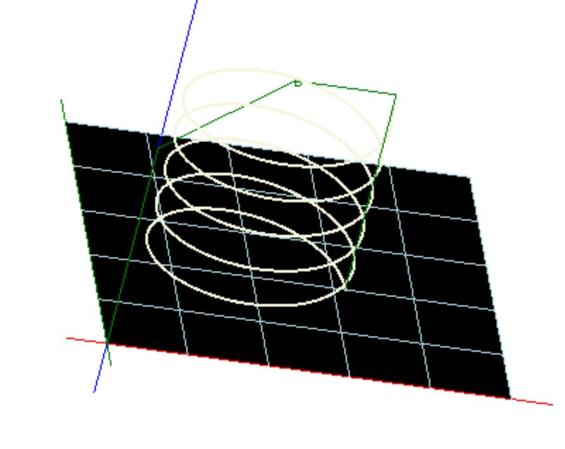
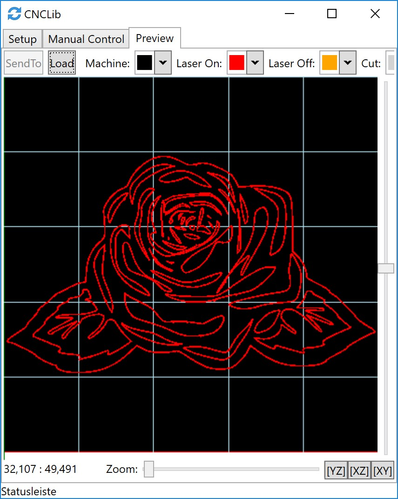
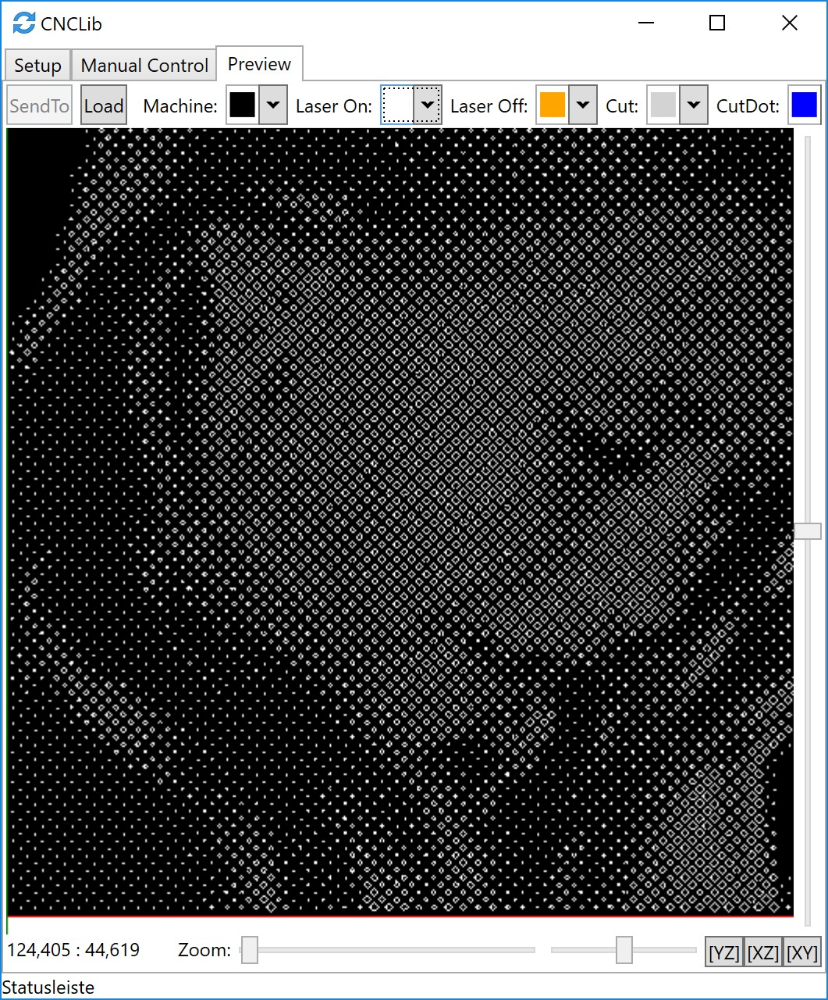
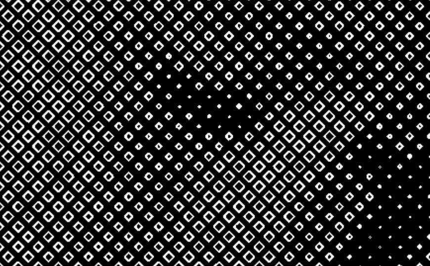

CNCLib / CNCStepper
======

Build your own CNC machine/laser with *CNCLib* and *CNCStepper*. 
Both projects are on github.

https://github.com/aiten/CNCLib  
https://github.com/aiten/CNCStepper

CNCLib
======

CNCLib is a Windows and Web application. 

The web application is hosted here: https://cnclib.azurewebsites.net 
(or cnclib.aitenbichler.cc)

Define and configure your own machine
------
- USB Port 
- Axis count and size
- Probe definition
- Initial commands 
- Custom commands  

Control your machine  
-------
- Send commands (gcode)
- Move axis
- Define zero-shift
- Read/Write SD
- Define rotations 
- Configure CNC machine by writing to the Eeprom
- Watch command history

Preview of CNC program 
-------
- Scroll
- Zoom in and out
- Rotate
- Define colors for machine, laser, mill, ...

Import GCode
=====
- Import as it is
- Add linenumbers
- Convert e.g. g82 (drill command) because your machine does not support the command

Import HPGL
======
- Import HPGL with "Resize" and "Move"
- Option for "grave" => the CNC program will follow the line
- Option for "cut" => the CNC program is created with an offset (laser-size or mill diameter) 

Import Image
=======
- Import Image - for laser
- Dither 

Image - for cut holes
=====
- Differnet hole shapes (diamond, heard, circle, ...)

   

With this import option a CNC program is created to cut holes into e.g. a paper. The width of the holes are calculated from the image depending on the brightness.  

